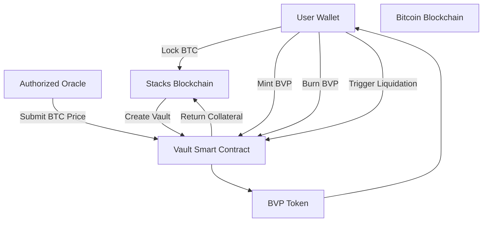

# BitVault Protocol (BVP)

A **decentralized, BTC-backed stablecoin system** on the [Stacks](https://www.stacks.co/) blockchain, enabling users to mint BVP tokens by locking Bitcoin (BTC) as collateral through smart contracts.

## Overview

BitVault empowers Bitcoin holders to unlock liquidity while retaining BTC exposure. The protocol leverages:

* Over-collateralized vaults (150%+)
* Decentralized price oracles
* Autonomous liquidation
* Governance-driven parameters

BVP is a SIP-010 compliant stablecoin, pegged to a stable value and backed by BTC locked via smart contracts.

## Core Features

* **BTC-Backed Stablecoin**: Mint BVP by locking BTC on Stacks.
* **Over-Collateralization**: Vaults must maintain a 150%+ collateralization ratio.
* **Decentralized Oracles**: Trusted oracles provide real-time BTC/USD prices.
* **Liquidation Mechanism**: Vaults below 125% collateralization are eligible for liquidation.
* **Governance Controls**: Protocol parameters are adjustable by the contract owner (DAO-ready).
* **Smart Contract Security**: Built in Clarity with overflow/underflow checks and formal verification support.

## Protocol Architecture



## Smart Contract Modules

| Module                | Functionality                                      |
| --------------------- | -------------------------------------------------- |
| **Stablecoin Engine** | Mint/Burn BVP, manage supply                       |
| **Vault System**      | Manage user vaults, collateral, minting/redemption |
| **Oracle Network**    | Submit/track BTC price data                        |
| **Risk Management**   | Check collateral ratio, trigger liquidation        |
| **Governance**        | Update parameters like fees and thresholds         |

## Key Parameters

| Parameter                 | Default       | Governance Function              |
| ------------------------- | ------------- | -------------------------------- |
| **Collateral Ratio**      | 150%          | `update-collateralization-ratio` |
| **Liquidation Threshold** | 125%          | `update-liquidation-threshold`   |
| **Mint Fee**              | 0.5%          | `update-mint-fee`                |
| **Redemption Fee**        | 0.25%         | `update-redemption-fee`          |
| **Max Mint Limit**        | 1,000,000 BVP | `set-max-mint-limit`             |

## Data Structures

| Name                | Purpose                        |
| ------------------- | ------------------------------ |
| `vaults`            | Track user vaults              |
| `vault-counter`     | Vault ID tracker               |
| `btc-price-oracles` | Authorized oracle list         |
| `last-btc-price`    | Latest BTC price and timestamp |

## Security Model

### 1. **Over-Collateralization Enforcement**

```clarity
(collateral_amount * btc_price) / minted_bvp >= collateralization_ratio
```

### 2. **Liquidation Protocol**

* Vaults <125% collateral are flagged
* Liquidators receive 10% bonus in collateral

### 3. **Oracle Reliability**

* Multi-oracle design with timestamp checks

```clarity
(define-public (update-btc-price (price uint) (timestamp uint))
  (asserts! (<= timestamp MAX-TIMESTAMP) ...))
```

### 4. **Formal Verification & Audits**

* Built in Clarity with math safety guarantees

## Governance

Controlled by `CONTRACT-OWNER` initially, with roadmap toward DAO governance for:

* Risk parameter updates
* Fee structure modifications
* Oracle addition/removal
* Protocol upgrades

Example Governance Call:

```clarity
(contract-call? .bitvault-protocol update-collateralization-ratio u175)
```

## Developer & Deployment Notes

* Use **Clarinet** or **Clarity REPL** for local development.
* Deploy and test on **Stacks testnet**.
* Simulate BTC locking and price updates via mock data during testing.

## Error Codes

| Code                                | Meaning            | Resolution                      |
| ----------------------------------- | ------------------ | ------------------------------- |
| `ERR-NOT-AUTHORIZED` / `u1008`      | Restricted access  | Confirm permissions             |
| `ERR-UNDERCOLLATERALIZED` / `u1003` | Ratio violation    | Add collateral or repay BVP     |
| `ERR-LIQUIDATION-FAILED` / `u1005`  | Not eligible       | Check vault status & price feed |
| `ERR-INSUFFICIENT-BALANCE`          | Not enough BVP     | Reduce redemption amount        |
| `ERR-ORACLE-PRICE-UNAVAILABLE`      | Missing price data | Wait for oracle update          |

## Use Cases

1. **DeFi Collateralization**

   * Supply BVP in liquidity pools or lending protocols

2. **BTC Liquidity Access**

   * Unlock stablecoin value without selling BTC

3. **Institutional Integration**

   * Managed BTC debt positions for enterprise use

## Summary

**BitVault Protocol** unlocks Bitcoin's potential in decentralized finance through a secure, over-collateralized stablecoin system. It combines the immutability of BTC with the programmability of Stacks to offer a robust, composable financial primitive—governed on-chain and secured by smart contract logic.
